# (某码农的不科学)投机市场观察录 
## [2022-7-20] [市场观察] 对村镇银行违约与停贷断供的一些想法
- 地方银行违约与房贷断供看起来和局外人没有直接关系,<br>
但其中可以挖掘出一个多数人相关的长期风险.<br>
<br>

- 地产繁荣时期<br>
大部分普通人没有大额储蓄,<br>
因为直接都被地产黑洞吸收了,<br>
未来二三十年也不会有.<br>
<br>

- 增值焦虑<br>
房价普跌背景下,<br>
"立刻买房"不再是必选项,<br>
而那些暂时避开了楼市深坑的普通人,<br>
即便深度厌恶着高风险的投机市场,<br>
也仍然面临着一个隐蔽的长期风险 ---- 增值焦虑<br>
<br>

- 人群特点<br>
通过多年劳动积累了一定数量的现金,<br>
长期受通胀环境与增值焦虑困扰,<br>
但资金和风险管理能力没有随账目金额同步成长,<br>
不擅长搜索引擎的使用,没有建立有效的信息获取渠道,<br>
缺乏对环境变化的敏感性,无条件信任银行的专业人士.<br>
<br>

- 焦虑的源头<br>
外部是通胀环境,<br>
内在是资金和风险管理能力没有随账目金额同步成长.<br>
<br>

- 解决之道<br>
(1)意识到个人能力边界,<br>
如果此生无法再成长半步,<br>
就将长期目标从增长转换为守业,<br>
主动降低预期,控制焦虑情绪.<br>
. <br>
(2)在财务与风险管理方面下功夫,<br>
投入相当的时间和精力在这之上,<br>
意识到1万 10万 100万,<br>
每个阶段需要不同的玩法和能力.<br>
. <br>
(3)让能力匹配的上欲望<br>
有着清醒的自我认识,<br>
不做能力边界以外的事情,<br>
不追逐能力边界之外的物品.<br>
. <br>
比如:<br>
靠短期预测和高杠杆在投机市场暂时撸到钱,后期普遍会又输回去,因为"预测"与"杠杆"是普遍无法掌控的能力,它们并不受控,人们追逐能力边界以外回报,求而不得,所以焦虑痛苦.<br>
. <br>
一个男性各方面条件都不是很好,即使暂时骗到一个高出他level的女人做老婆,后期女方大概率也会发现她在市场上可以匹配到更好的人选,而发展成矛盾或者坏的结局,以一种"均值回归"的过程结束.<br>
<br>

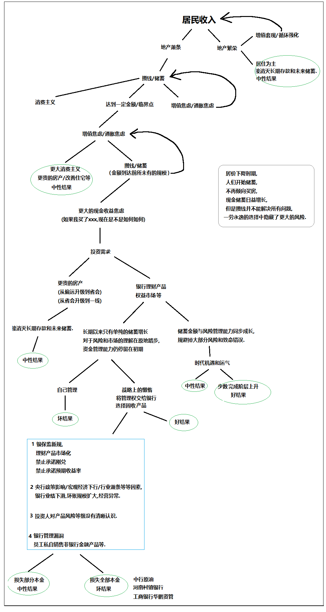
<br>

###### 注:
###### 在2018出台的银保监理财管理办法中明确了两点
1 禁止商业银行承诺理财产品的保本收益和刚性兑付.<br>
2 禁止商业银行宣传理财产品的预期收益率.<br>
<br>

###### 猜测银保监禁止保本刚兑的动机是什么?<br>
- 经济下行时期(尤其地产相关),普通银行在市场中也无法做到100%赚到钱,<br>
如果收益不达标,刚兑意味着银行要自掏腰包支付客户的收益.<br>
长期垫付收益,会导致机构的坏账率上升,积累更大的连锁危机,银行被压垮,引发系统性风险.(危机到来大家一起死)<br>
打破刚兑,将风险转移给每个客户,就可以防止积累系统性风险.(危机到来牺牲少部分人.)
<br>

- 做顶层设计的人已经预判了经济下行带来的连锁反应,<br>
预判到了地产拐点发生后,银行坏账规模的扩大,投资亏损概率的上升<br>
(因为房地产是资金主要流向,地产不景气银行的投资也亏本)<br>
所以调整政策,提前将风险转移给了每个个体.<br>
<br>

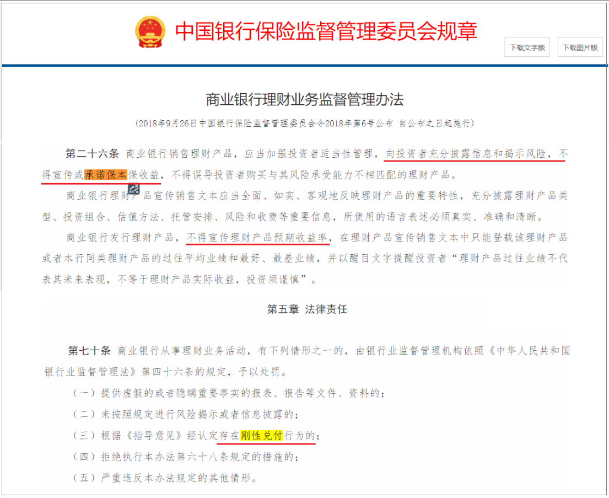
<br>

## [2022-5-25] [交易系统] 冰糖橙定投简易指标
#### 指标1：彩虹图
从绿色系(BUY)开始向下,是比较好的买入时机,而到黄色(HODL)开始以上就不要加仓了.<br>
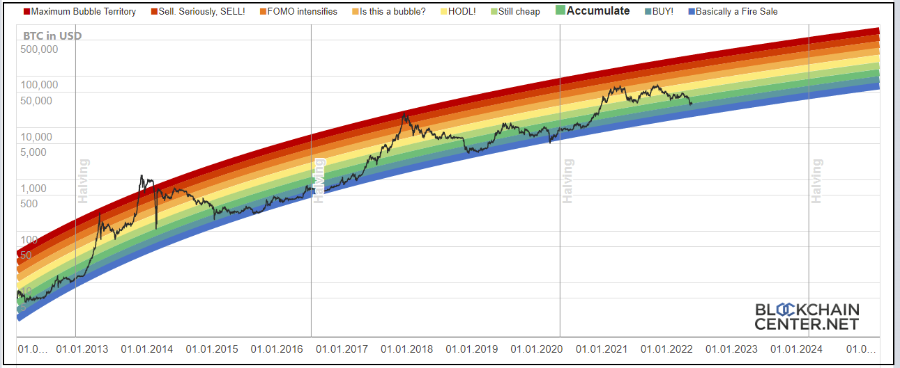

#### 指标2：AHR999
ahr999数值介于1.2和0.45之间是比较好的买入时机,并且越小越好.<br>
0.45常常是历史上极佳的买点.如果你喜欢加杠杆,耐心等待0.45的附近是一个比较稳妥的选择.<br>
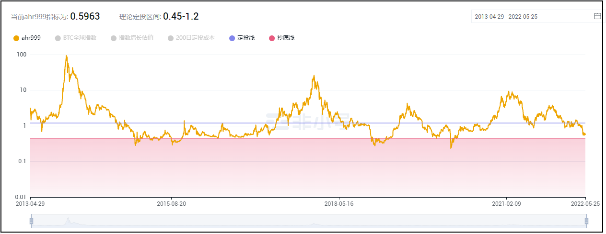

#### 指标3：美元实际利率
在美元实际利率大幅度上升的阶段，常常伴随着资产价格暴跌，<br>
所以在它上升的这一年半载，最好什么都不做，或者开空也行，最起码不要加仓做多。<br>
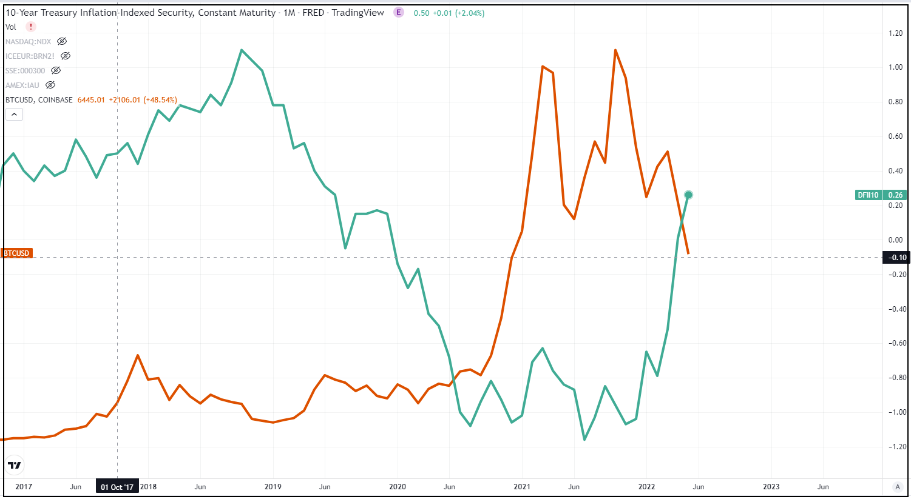

#### 指标4：减半节点与S2F估值模型
S2F是冰糖橙比较常见估值模型，<br>
它指出了冰糖橙的长期价格走向，<br>
S2F的显著特点是,<br>
显示每次减半节点过后,<br>
冰糖橙价格会攀升的水平位置,<br>
下一次减半时间为2024.4.13,<br>
对长期交易者来说建仓截至到此,<br>
对短期交易者来说在这以后减少做空。<br>
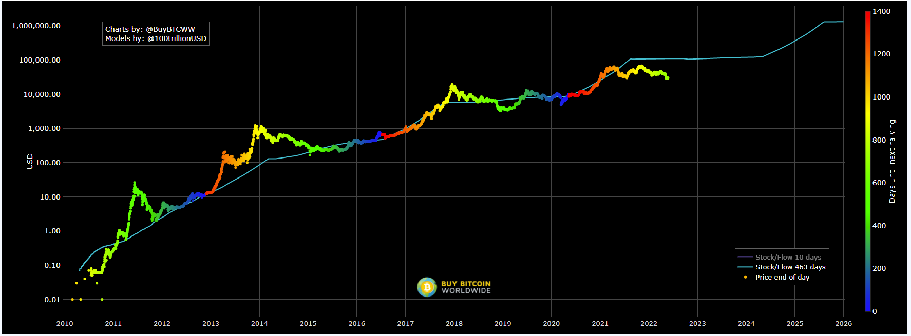

#### 指标5:  days from ath
叠加几轮周期高点后的价格表现,来观测市场目前大致处于哪个阶段<br>
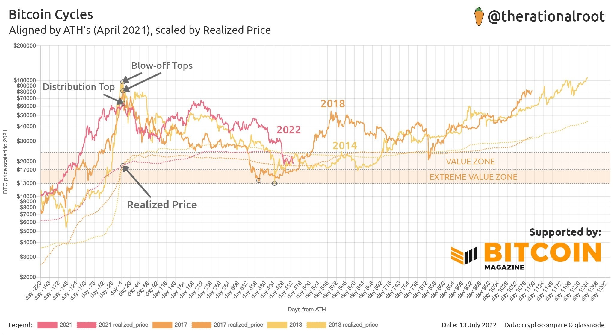

参考：<br>
[彩虹图](https://www.blockchaincenter.net/en/bitcoin-rainbow-chart/)<br>
[ARH999](https://www.fxhapp.com/data/ahrdata.html)<br>
[实际利率](https://fred.stlouisfed.org/series/DFII10)<br>
[S2F](https://stats.buybitcoinworldwide.com/stock-to-flow/)<br>
<br>

## [2022-5-23] [市场观察] <<经济回报、利率、汇率、资产和负债 价值和估值>>
###### 原文：<br>
[wechat: 经济回报、利率、汇率、资产和负债 价值和估值](https://mp.weixin.qq.com/s/fs-wMetDFe5HmCl3f8tztA)<br>
[备份：经济回报、利率、汇率、资产和负债 价值和估值](./data/readme/2022-5-23-1.7z)<br>
###### 阅读大咖长文后的资料整理,内容涉及全球资本流动模型、中国近几年市场表现<br><br>
###### 情况1<br>
美联储加息阶段, A国增长>美国增长<br>
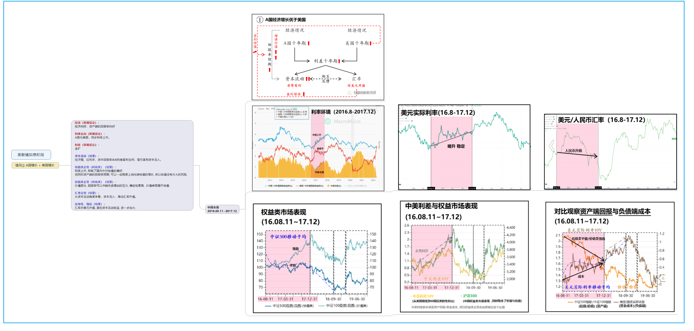
<br><br>

###### 情况2<br>
美联储加息阶段, A国增长<美国增长<br>
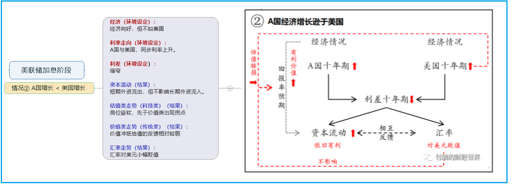
<br><br>

###### 情况3<br>
美联储加息阶段, A国经济下行<br>
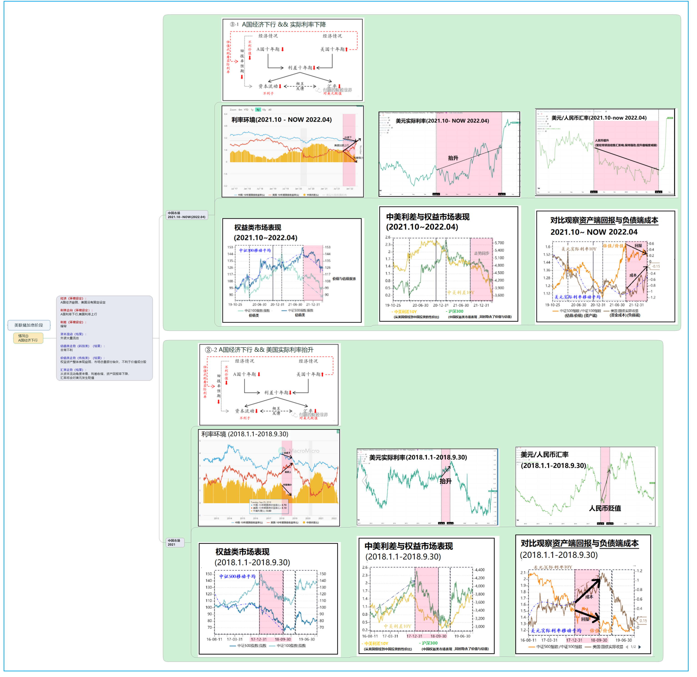
<br><br>

###### 情况4<br>
美联储处降息阶段, A国大衰退, 美国小衰退<br>

<br><br>

###### 情况5<br>
美联储处降息阶段, A国小衰退, 美国大衰退<br>
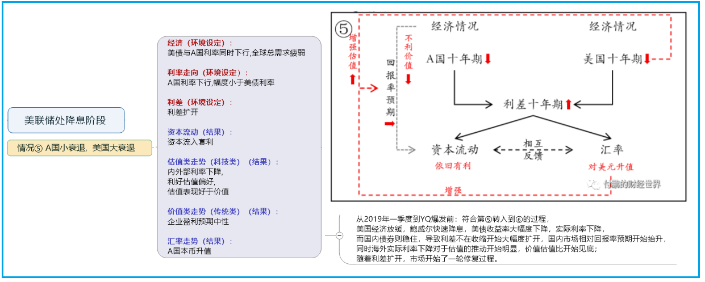
<br><br>

###### 情况6<br>
美联储处降息阶段, A国增长，美国衰退<br>
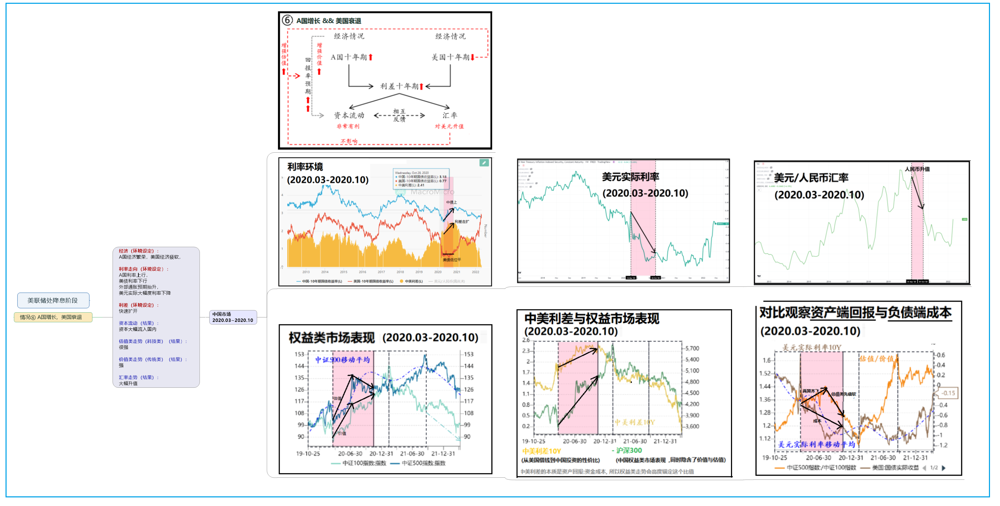
<br><br>

##### 资本流动关键
```java
国债收益率 ≈ 市场中的无风险收益率 ≈ 名义利率

利率的主导者：外部：美联储，内部：本国央行，手段：公开市场操作等

利率的传导性：信用越低的借贷方，给出的借贷利率越高，才能借到钱。

利差 == 两个国家的利率之差 == 套利机会（从A国借钱，到B国放贷，无风险的赚钱机会，引导资金流动的关键）

负债端成本 == 借钱成本 == 资金成本 ≈ 美元实际利率 

利率影响资产价格的理论解释 == 现金流贴现法

利率对资金风险偏好的影响：加息时偏好价值类 谈现实，降息时偏好估值类 谈理想。
```
<br><br>

## [2022-4-22] [市场观察] 从负债端看资产回报率
#### 观点来自东北证券-付鹏
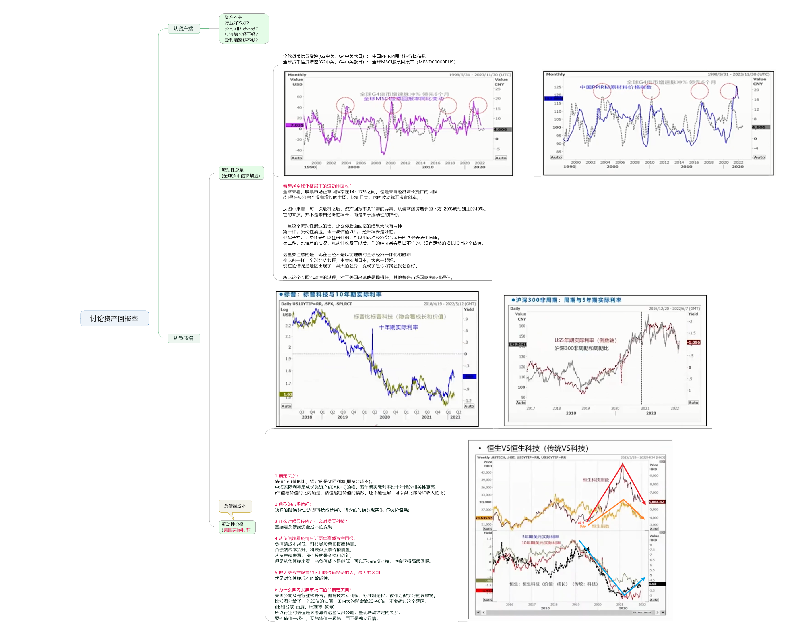
<br><br>

#### 全球主要货币信贷增速 <--> PPIRM、MSCI全球股指
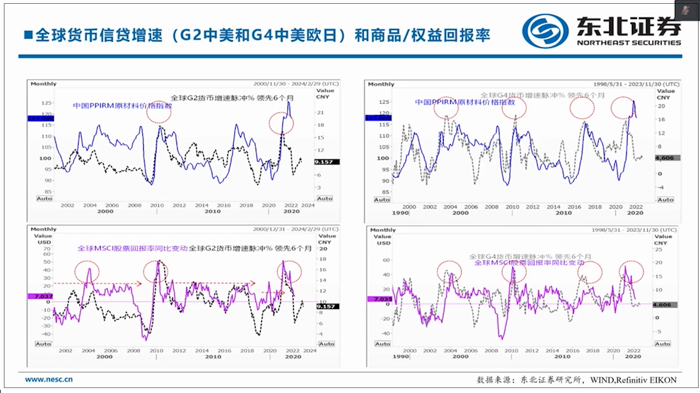
<br><br>

#### 流动性视角,解读中美利差的本质
```java
1 中债理解成投机标的，即资产回报。
2 美债收益率理解成名义利率，借钱去其他投机市场炒作的成本，即负债端。
3 从这个资产负债的视角来看，中美利差的本质，即资产回报:负债端成本 (理解成两者比值)
4 如此就可解释，为什么投机市场走势、各市场指数，会高度关联或者说锚定中美利差。
```
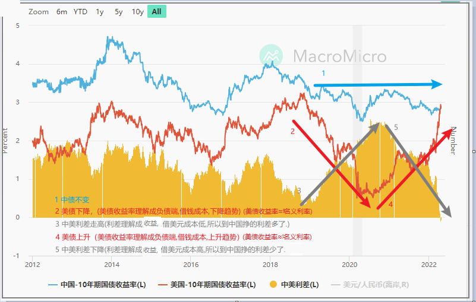<br>
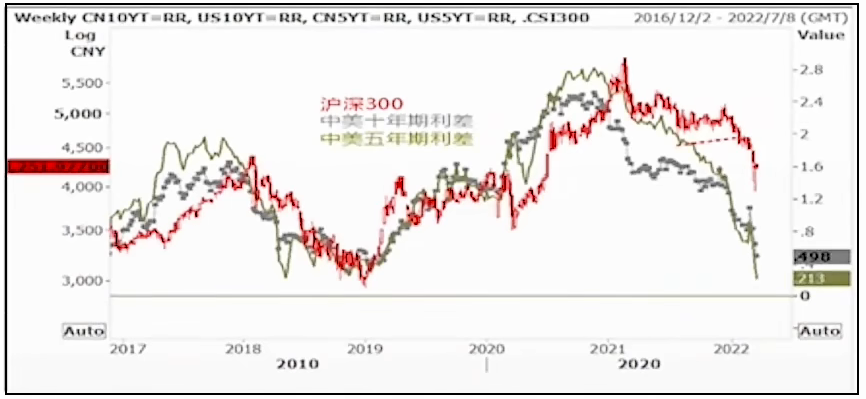
<br><br>

#### 流动性视角,解读长短期美债收益率倒挂的本质
```java
在2016年以后，
长端美债代表全球(包括中国 欧洲在内国家,弱势的经济增长和回报)
短端美债代表美国(仅仅代表当前强势复苏的美国)
所以长短端美债倒挂和中美利差倒挂，性质上是一回事，
美国可以承受强势加息，在加息中复苏，而其他国家承压放缓增长。
反映在资产上是新兴国家股市崩溃，反映在汇率上是新兴市场国家货币大幅度贬值。
```
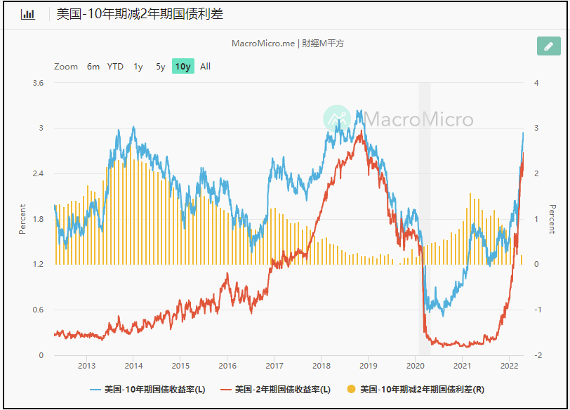
<br><br>

## [2022-3-22] [市场观察] 为什么加密原住民在这一轮周期要重点观察美股？
因为加密市场参与者的结构发生了变化,<br>
和以往的参与者类型不同，<br>
这一轮涌入了大批的美股大玩家(同时还驱逐了大量的中国散户)，<br>
美股玩家会用他们的逻辑给大饼定价，<br>
他们的交易习惯和资金使用特点，<br>
会深刻的影响大饼的中短期走势。<br>
(进而影响左侧人群的抄底时机)<br>
<br>
**参考：科技股特斯拉走势vs大饼走势** <br>
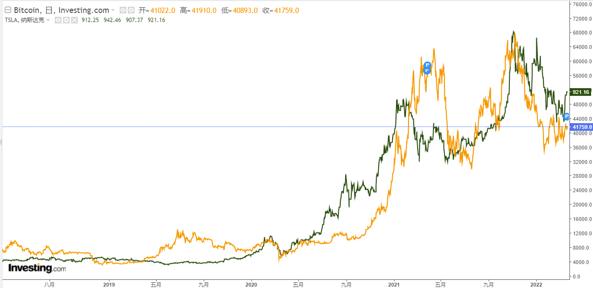  
<br>
**为什么呈现出美股化的趋势？**<br>
我理解，美股玩家用他们"现金流贴现法"类似的习惯给大饼定价(**贴现率的变化会引起大饼价格波动**),把大饼当成一种科技股来买卖,并且通过他们近两年低廉的资金成本(一系列放水所致)，暂时掌控了定价。
<br><br>
**我们关心什么？**<br>
如果之前大饼和特斯拉走势相似，那缩表+加息的牌全部打出，<br>
按照现金流贴现的逻辑科技股跌，大饼跟着一起跌吗？<br>
在一两年之间，还能继续刻舟求剑吗？走出自己以往的节奏吗？<br>
<br><br>

## [2022-3-22] [市场观察] 经济衰退红灯，长短期美国国债收益率即将倒挂
  
<br>

**正常情况**：时间越长利息越高  
十年期美债收益率 > 两年期美债收益率
<br>

**异常情况**：("美债收益率倒挂"现象)  
十年期美债收益率 < 两年期美债收益率
<br>

**差值**：  
差值=十年收益率-两年收益率  
差值<0时，常常是美国经济衰退时期.
<br>

**划重点**：<br>
我们关心什么？<br>
更多的是,市场大概处于一个什么位置,一个大致的拐点区间.<br>
类似巴菲特之类的老油条最擅长,手握天量现金，平常没有多余的动作，等崩溃时来一发.<br>
(三五年内就那么一次好机会,最多能精确到某年上半年还是下半年的样子,能从2021憋到现在,其实也能超过很多人了)<br>
<br><br>

## [2022-3-15] [市场观察] 中概互联的价值重估
(不局限于中概互联，范围扩展可能是所有中国核心资产)  
(1)第一层BUFF：美元流动性收紧,引发的估值泡沫破裂  
(2)第二层BUFF：互联网产业周期寡头阶段行情  
(3)第三层BUFF：反垄断、共同富裕目标、互联网基础设施公共服务化趋势  
(4)第四层BUFF：逆全球化趋势,中美重演俄乌金融封锁的预期,引发外资不计成本的抛售中国资产  

第一层BUFF：美元流动性收紧,引发的估值泡沫破裂  
根据美元指数和港股指数负相关的常识，对比它们的趋势可以显而易见的观察到流动性的变化。  
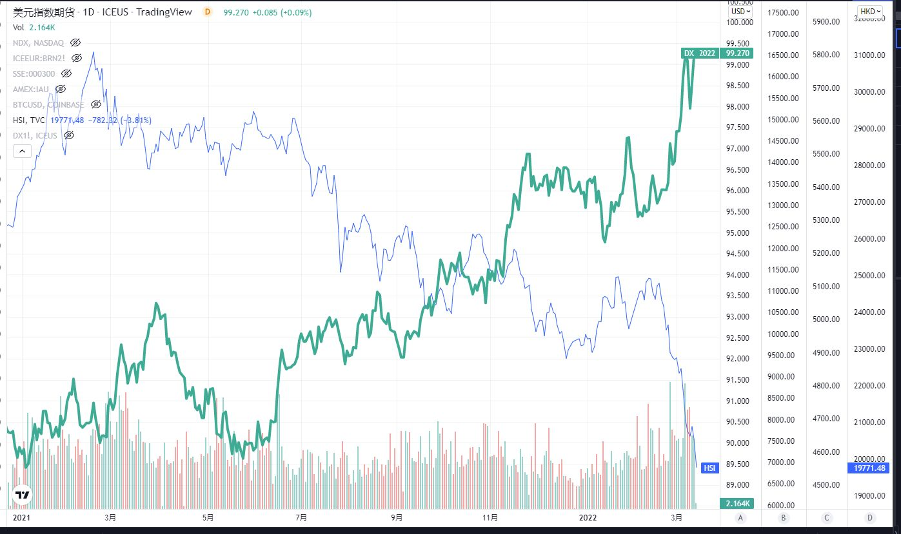  
(美元指数vs港股大盘)  
<br>
中丐互联科技公司的股价几乎都是2020 3月吹泡泡吹起来的。  
  
(美元指数vs中概互联指数基金)  
<br>
第二层BUFF：互联网产业周期寡头阶段行情  
参考工业革命成熟期的走势  
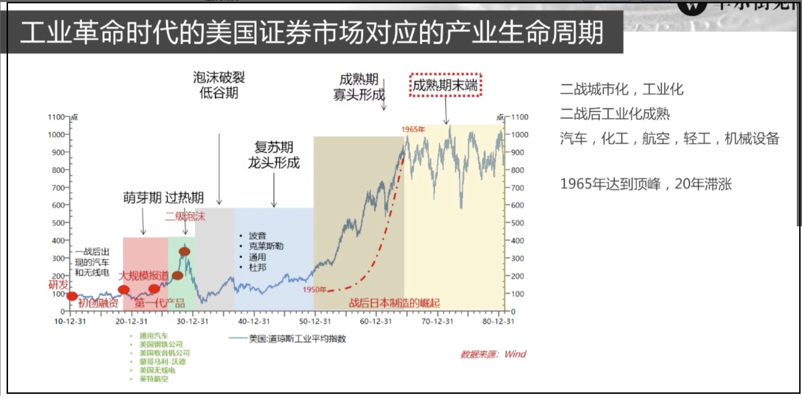  
<br>
第三层BUFF：反垄断、共同富裕目标、互联网基础设施公共服务化趋势,重塑估值方式  
"如果只是一个政策的冲击，  
你冲击的可能是对盈利的判断，  
但这个还都在正常的逻辑下，  
但是如果你的整个商业模式都发生重大的变化了，  
那你可能甚至是说，  
整个商业模式在中国的政策目标里未来都转向一个公共服务类，  
甚至带有一定这个这个公益性质的行业的话，  
那这可不是一个简单的光盈利预期下修的问题."  ----来自付总  
<br>
第四层BUFF：逆全球化趋势,中美重演俄乌金融封锁的预期,引发外资不计成本的抛售中国资产  
  
为什么在2022年3月这个时间点通过"中概下市法案"？  
猜测：为了驱赶欧洲资本逃出欧洲，同时不能流向中国，保障回流到美国国内。
<br><br>

## [2022-3-15] [市场观察] 回忆312币圈纪念日  
以下是312暴跌的逻辑和发生经过（按照时间顺序和逻辑关系如下):  
疫情、全球股市、经济危机、流动性恐慌等宏观情绪传染到币圈，引发2月中旬到3月上旬的下跌调整。   
减半一致性预期被击溃，且比特币避险属性共识开始瓦解，市场负预期严重。   
<br>
巨鲸出货卖盘增加。 引发下跌进一步下跌。  
投机客、资管量化、苦命的矿工多头杠杆（包括借贷平台、场内杠杆现货、Defi去中心化借贷）自我叠加式爆仓，  
价格快速进入自我加强的下跌 价格下跌如此之快，  
乃至BitMEX上的套利党爆仓导致互相踩踏，  
进一步加速下跌，价格如同自由落体一般。  
<br>
Btc拥堵充值不进去、搬砖口子小引发的USDT溢价过高一起共同导致了场外入金严重不足。  
场外入金难以抵挡场内的爆仓螺旋，价格颓势难以抵挡。   
Maker的eth抛压，造成了价格进一步下跌。  
并且，赎回dai进一步造成了流动性枯竭。   
<br>
圈外空军见到这个情况，如同嗅到了猎物，也加入做空行列，价格接着下探。  
直至Bitmex拔了网线，市场上的最大卖盘瞬间停止，场外流动性开始跟上，  
且Bitmex用自己的保险金吃爆仓单，一下子稳住了市场，开始反弹。  
<br>
Bitmex冷不丁把吃的爆仓单投入市场，且小心翼翼避免价格再度被砸下去，盘面开始平稳。  
至此3月15日，无数媒体开始散步悲观信息，以至于币价处于低位而人心惶恐，一时间加密资产信心受到重创。  
<br>
  
<br>
1.3倍低杠杆爆仓的行情历历在目:   
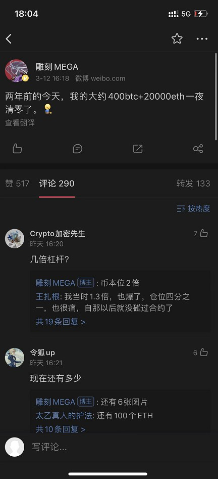  
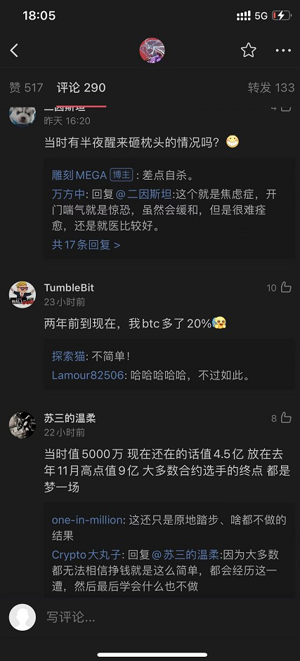  
<br><br>

## [2022-2-23] [状态记录] 记录美指、纳斯达克、中概互联、阿里巴巴
时代背景版：  
1 距离新冠病毒流行传播两年后。<br> 
2 全球大放水资产价格全面暴涨结束后。<br> 
3 美联储2022-3月加息预期前，北约逼宫俄罗斯地缘冲突加剧，美元回归美国国内，美指趋势走强，全球流动性收紧。<br> 
4 中国反垄断打压互联网巨头一年后,以阿里巴巴为代表的中概互联指数回撤50%-60%后。<br> 
5 芒格2021首次抄底阿里巴巴后回撤40%+，2022依然加仓阿里，桥水基金达里欧加仓阿里巴巴。<br> 
  
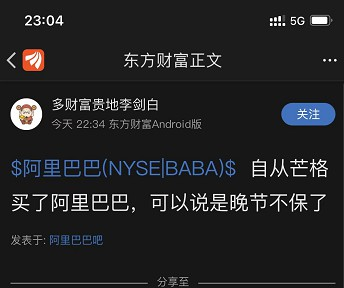  
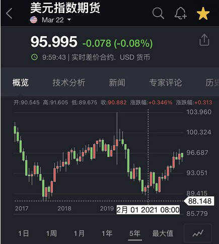  
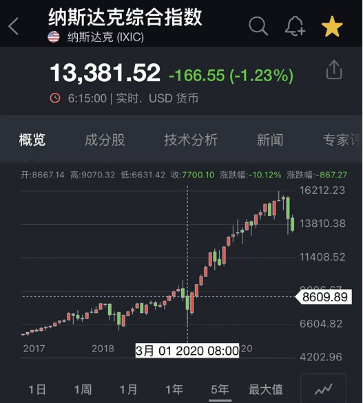  
  
  
  
  
  
<br>

## [2022-2-16] [市场观察] 恒大危机启示
- 最大的风险<br>
最大的风险永远来自，对长期现金流的乐观预期，对人为背书刚性兑付承诺的盲目信任。<br>
在行业状态顶峰时期，或临近拐点，仍然做出大发幅度动作。<br>
  
- 典型案例：<br>
拐点时期加大投资数目，大胆扩张规模，刷信用卡凑首付、拉满30年贷款买房，<br>
体现了对长期稳定收入、稳定增长的乐观预期，而这个预期是一种毁灭性的错误。<br>
[许家印不想贱卖资产 恒大员工却只能卖自住房](./data/readme/2022-2-16-2.txt)  
<br>

## [2022-2-16] [市场观察] 记录于FB股价腰斩后
我理解,元宇宙最大的变数来自政治正确。  
哪种政治正确？  
对科技巨头数据垄断行为的反对和声讨，用户对数据和隐私去中心化的汹涌浪潮。  
.  
对于互联网去中心化改造的可行性，WEB 3.0的实施，还没有一个明确的解决方案，  
但这并不影响民众对科技巨头的讨伐声浪，对中心化与WEB 3.0更多的变成一种二元对立，一种立场和口号。  
.  
什么是政治正确？政治正确是非理性的，不讲效率和成本，甚至是傻逼的共识，  
但傻逼的共识也是共识，它将成为多方利益博弈的筹码，最终反应到行政决策和市场价格。
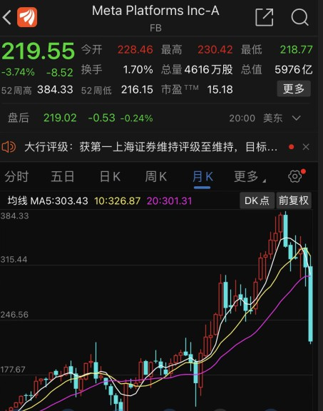

