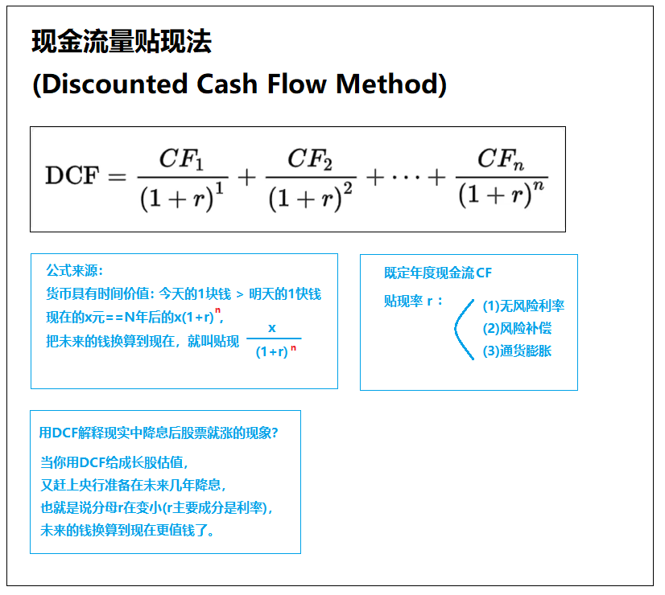
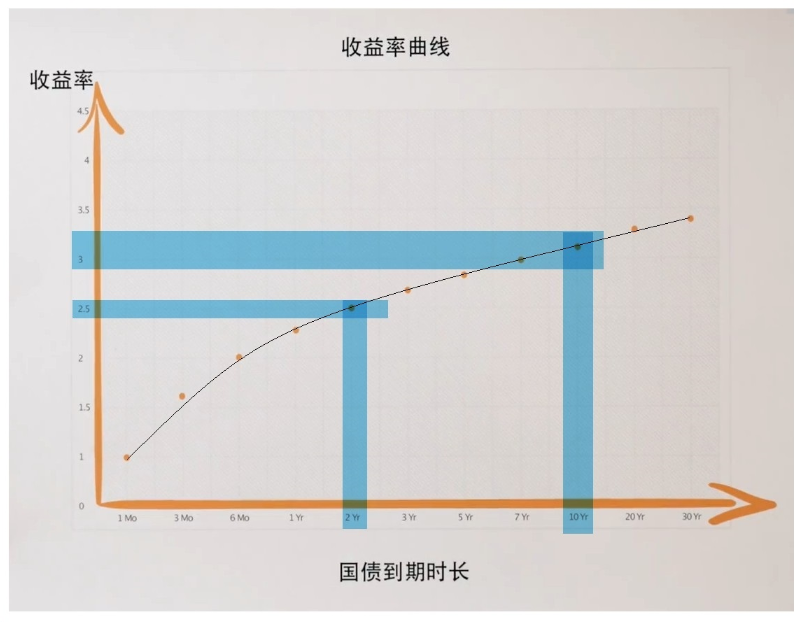
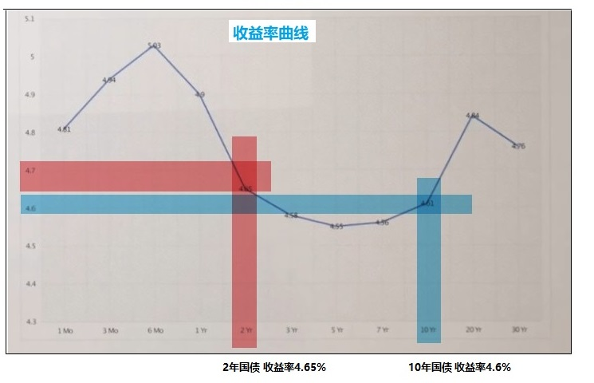
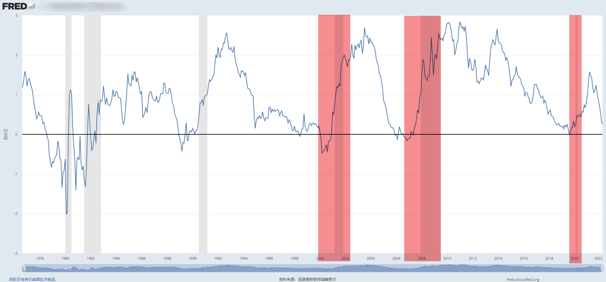

# 投资常识
#### [2022-3-19] 为什么美债会影响全球资产价格？
- 借贷利率会互相参考，具有传导性、竞争性。
```java
    逻辑：
    
    美债由国家背书/信用好/无风险.
        |
    信用好代表着,使美债收益率偏低也不愁卖.
        |
    其他借贷品种要比美债收益高才有人买,不得不参考美债收益率.
        |
    美债间接影响了借贷市场利率,美债收益率成为全球资产定价之锚.
        |
    美国人如果能操控美债收益率，就能影响全球其他资产价格.
```
<br>

#### [2022-3-19] 美国人如何操控美债收益率？
- 公开市场操作(open market operation)  
即亲自参与市场交易，而非强制命令。  
中央银行到二级市场买卖债券，影响供需关系，改变债券价格。  
```java
    逻辑：
    
    美债价格与美债收益率负相关，当美债价格上升，美债收益率下降.
        |
    中央银行可以参与二级市场的美债交易.
        |
    中央银行在二级市场买入美债，减少了市场上的美债供给，进而提高美债价格.
        |
    美债价格上升，美债收益率下降.
        |
    影响全球资产价格.
```
- 改变银行储备金率
- 优惠利率(prime credit rate)
- 其他
<br>

#### [2022-3-19] 美国国债常识
```java
        市场利率(市场无风险利率)
市场利率这个概念是很宽泛的，往大了说只要是市场定价的都可以是市场利率,
去银行贷款利率是市场利率，银行间的拆借利率是市场利率,十年国债收益率也是市场利率。
通常说的市场利率，指的是市场无风险利率，没有人可以钦定市场无风险利率，它取决于资产篮子和市场。


        票面利率(Coupon Rate)：
由官方决定，比如一级市场拍卖时，设定票面利率为5%，
则到期收益=面值100*票面利率5%


        国债发行价格
由官方拍卖决定，一旦拍卖就确定了。
比如面值100，票面利率5%，拍卖时95卖给你， 最终成本加收益=100+(100 * 5%)-95
比如面值100，票面利率5%，拍卖时100卖给你，最终成本加收益=100+(100 * 5%)-100
比如面值100，票面利率5%，拍卖时103卖给你，最终成本加收益=100+(100 * 5%)-103


        国债市场价格
把国债拿到二级市场自由交易，由市场供需产生的价格。


        国债收益率
它是一个全面衡量国债投资回报大小的指标，  
国债在二级市场价格越高，国债收益率指标越低，呈负相关。


        为什么国债市场价格，和国债收益率负相关？   
面值100，票面利率5%，一级市场发行价格100，二级市场价格105。
如果用105的成本买下，简单的计算最终成本加收益 -> 100+(100 * 5%)-105，
所以在二级市场，买入成本越贵，收益就越低。
国债价格↑，国债收益率↓
国债价格↓，国债收益率↑


        总结利率、债券、股市的一般规律
市场利率涨 - 债券价跌(债券收益率涨) - 股市跌
市场利率跌 - 债券价涨(债券收益率跌) - 股市涨


        银行利率为什么可以影响二级市场的国债价格？
当银行利率上升，超过了国债票面利率很多，
人们会抛售手中的国债，去买其他收益更高的银行利率产品，
国债供给增加，价格就会下降。


        新发行的国债为什么可以影响二级市场的国债价格？
因为新发行的国债，票面利率可能和以前的不一样。
假设：
2000年发行面值100的国债，票面利率为3%，发行后在二级市场交易。（简称A）
2001年发行面值100的国债，票面利率为5%，发行后在二级市场交易。（简称B）
由于B的收益更高，人们会抛售A去买B，A的供给增多，导致A的二级市场价格跌，直到(A的二级市场价格+100*3%) == (100+100*5%)平衡为止


参考:
https://www.zhihu.com/question/67844574
https://zhuanlan.zhihu.com/p/370122131
https://www.zhihu.com/question/20276427
https://www.bilibili.com/read/cv8468865
https://www.sohu.com/a/405519880_120510187?_trans_=000014_bdss_dkbjyq

```
<br>

#### [2022-3-19] 为什么央行一降息，股票就容易涨价？
"为什么央行一降息股票就容易涨价？"  
这个问题等同于  
"未来的钱换算到现在值多少钱？"  
根据现金流贴现的说法，我找到了答案:  

<br>

#### [2022-3-19] 美债收益率倒挂信号代表着什么？
<a name="common20223191"></a>
- 什么是美债收益率倒挂?  
正常情况：时间越长利息越高  
十年期美债收益率 > 两年期美债收益率  
  
异常情况：("美债收益率倒挂"现象)  
十年期美债收益率 < 两年期美债收益率  
  
长短期美债收益率的差值  
利差=十年收益率-两年收益率，当利差<0时，  
**常常预示着美国经济衰退的到来**  
  
<br>

- 原理  
```java
如果"十年收益率-两年收益率<0",
要么十年收益率下跌，要么两年收益率上涨.
这里讨论第一种情况,因十年收益率下跌导致的倒挂.

一种常见的解释是:
投资者普遍认为经济将要衰退后，
用资金投票做出选择，
超买十年期美债,改变供求导致其涨价(也就是收益率跌),
在债券市场呈现出"美债倒挂现象"。  

还要注意不要因果倒置:
最初,并不是债券市场出现"美债倒挂现象"，  
投资者才意识到经济将要衰退。
```
<br>

- 参考:  
数据来源：  
https://fred.stlouisfed.org/series/T10Y2Y  
更专业的解释：  
https://www.zhihu.com/zvideo/1330536462027403264  